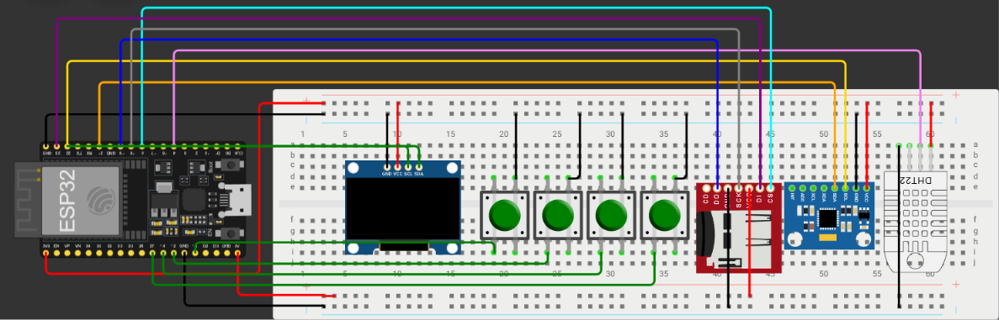
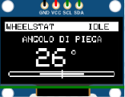
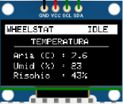
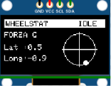
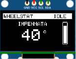
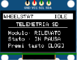

# WheelStat

>  **Seleziona la lingua / Select your language:** [🇮🇹 Italiano](#italiano) · [🇬🇧 English](#english)

---

## 🇮🇹 Italiano

WheelStat è un sistema di telemetria open source basato su **ESP32**, progettato per moto. Grazie all'integrazione di un sensore IMU (**Bosch BNO055**), il sistema monitora in tempo reale l'angolo di piega, l'angolo di impennata e le forze G dinamiche, calcolando contemporaneamente un indice di rischio di perdita di grip basato sui parametri ambientali rilevati da un sensore **DHT22**.

I dati vengono visualizzati live su un modulo display OLED 0.96" con 4 pulsanti integrati tramite un'interfaccia a 5 schermate e salvati automaticamente su una scheda MicroSD in formato CSV per l'analisi post-sessione.

### 📑 Indice

- [Architettura Hardware](#it-architettura)
- [Bill of Materials](#it-bom)
- [Schemi e Immagini del Progetto](#it-schemi)
- [Come Funziona il Rischio Grip](#it-come-funziona)
- [Librerie Richieste](#it-librerie)
- [Struttura dei Dati di Log (CSV)](#it-csv)
- [Note di Sicurezza](#it-sicurezza)
- [Licenza](#it-licenza)
- [Autore](#it-autore)

#### Interfaccia Grafica

| Pagina | Contenuto |
|---|---|
| **Page 0 — Piega** | Visualizzazione dell'angolo di inclinazione laterale con barra grafica dinamica e alert di pericolo |
| **Page 1 — Meteo** | Monitoraggio della temperatura, umidità dell'aria e percentuale di rischio grip |
| **Page 2 — Forza G** | Radar 2D grafico con tracciamento vettoriale delle accelerazioni |
| **Page 3 — Impennata** | Monitoraggio dell'angolo di beccheggio con indicatore verticale grafico |
| **Page 4 — SD Diagnostics** | Stato di funzionamento della MicroSD, nome del file corrente e minuti registrati |

### Architettura Hardware

Il centro del progetto è un microcontrollore **ESP32 DevKit V1** (30 o 38 pin).

#### Schema di Cablaggio (Pinout)

Tutti i moduli comunicano con l'ESP32 tramite i bus standard I2C e SPI o pin digitali dedicati:

| Componente | Bus / Segnale | Pin ESP32 | Note |
|---|---|---|---|
| OLED SSD1306 | I2C (SDA) | GPIO 21 | Condiviso con BNO055 |
| OLED SSD1306 | I2C (SCL) | GPIO 22 | Condiviso con BNO055 |
| Bosch BNO055 | I2C (SDA) | GPIO 21 | Indirizzo I2C standard: 0x28 |
| Bosch BNO055 | I2C (SCL) | GPIO 22 | Indirizzo I2C standard: 0x28 |
| Lettore MicroSD | SPI (CS) | GPIO 5 | Chip Select |
| Lettore MicroSD | SPI (MOSI) | GPIO 23 | Master Out Slave In |
| Lettore MicroSD | SPI (MISO) | GPIO 19 | Master In Slave Out |
| Lettore MicroSD | SPI (SCK) | GPIO 18 | Serial Clock |
| Pulsante SU | GPIO Digitale | GPIO 13 | Configurato come INPUT_PULLUP |
| Pulsante GIÙ | GPIO Digitale | GPIO 12 | Configurato come INPUT_PULLUP |
| Pulsante OK | GPIO Digitale | GPIO 14 | Configurato come INPUT_PULLUP |
| Pulsante LOG | GPIO Digitale | GPIO 27 | Configurato come INPUT_PULLUP |

### Bill of Materials

| Componente | Quantità | Note |
|---|---|---|
| ESP32 DevKit V1 (30/38 pin) | 1 | Microcontrollore principale |
| Bosch BNO055 (breakout) | 1 | IMU a 9 assi, sensor fusion hardware |
| DHT22  | 1 | Sensore temperatura/umidità (resistenza di pull-up integrata nel modulo) |
| Display OLED SSD1306 (I2C, 128x64) | 1 | Interfaccia grafica |
| Modulo lettore MicroSD (SPI) | 1 | + scheda MicroSD formattata FAT32 |
| Pulsanti tattili | 4 | SU / GIÙ / OK / LOG (resistenza di pull-up integrata nel modulo)|
| Cavi jumper / dupont | q.b. | Collegamenti |
| Alimentazione (powerbank) | 1 | alimentazione usb-c |

### Schemi e Immagini del Progetto

#### Schema Elettrico / Circuitale

#### Schema Topografico

#### Interfaccia OLED

### Come Funziona il Rischio Grip

L'indice di rischio grip è una stima, non una misura diretta di aderenza. Il firmware incrocia la temperatura e l'umidità rilevate dal DHT22 per valutare condizioni potenzialmente sfavorevoli (es. asfalto freddo o umido) e restituisce una percentuale di rischio indicativa, mostrata a display con eventuali allarmi visivi. Non sostituisce la valutazione diretta del pilota sulle reali condizioni dell'asfalto.

### 📦 Librerie Richieste

Per compilare correttamente il firmware su Arduino IDE assicurati di aver installato le seguenti librerie:

- `Adafruit BNO055` (di Adafruit)
- `Adafruit SSD1306` (di Adafruit)
- `Adafruit GFX Library` (di Adafruit)
- `DHT sensor library` (di Adafruit)
- `Adafruit Unified Sensor` (richiesta come dipendenza comune)

### Struttura dei Dati di Log (CSV)

I file di log vengono salvati in modo sequenziale nella root della SD con la nomenclatura `LOG_1.CSV`, `LOG_2.CSV`, ecc. I dati vengono aggregati e scritti su file ogni minuto.

### ⚠️ Note di Sicurezza

WheelStat è pensato come strumento di analisi post-sessione e non come ausilio alla guida in tempo reale. Non consultare il display mentre si è in movimento: tenere sempre lo sguardo sulla strada/pista ha priorità assoluta.
Il display deve essere consultato post sessione registrandolo con una telecamera esterna per avere un feedback preciso nell'istante desiderato.
Il rischio grip calcolato è indicativo e non sostituisce l'esperienza del pilota né la valutazione diretta delle condizioni dell'asfalto e degli pneumatici. Verifica sempre che il montaggio dell'hardware sul veicolo sia solido e non interferisca con comandi o visuale.

### 📄 Licenza

Questo progetto è distribuito sotto licenza **Apache License 2.0**. Consulta il file [LICENSE](LICENSE)

### Autore

Progettato e sviluppato da **Alessandro Rota** con il supporto indispensabile di (tanta) caffeina.

---

## 🇬🇧 English

WheelStat is an open source telemetry system based on **ESP32**, designed for motorcycles. Thanks to the integration of an IMU sensor (**Bosch BNO055**), the system monitors in real time the lean angle, wheelie angle and dynamic G-forces, while simultaneously calculating a grip-loss risk index based on the environmental parameters detected by a **DHT22** sensor.

Data is displayed live on a 0.96" OLED display module with 4 integrated buttons through a 5-screen interface, and is automatically saved to a MicroSD card in CSV format for post-session analysis.

### 📑 Table of Contents

- [Hardware Architecture](#en-architecture)
- [Bill of Materials](#en-bom)
- [Project Diagrams and Images](#en-diagrams)
- [How Grip Risk Works](#en-how-it-works)
- [Required Libraries](#en-libraries)
- [Log Data Structure (CSV)](#en-csv)
- [Safety Notes](#en-safety)
- [License](#en-license)
- [Author](#en-autore)

#### Graphic Interface

| Page | Content |
|---|---|
| **Page 0 — Lean** | Display of the lateral lean angle with a dynamic graphic bar and danger alert |
| **Page 1 — Weather** | Monitoring of temperature, air humidity and grip risk percentage |
| **Page 2 — G-Force** | 2D graphic radar with vector tracking of accelerations |
| **Page 3 — Wheelie** | Monitoring of the pitch angle with a vertical graphic indicator |
| **Page 4 — SD Diagnostics** | MicroSD operating status, current file name and minutes logged |

### Hardware Architecture

The core of the project is an **ESP32 DevKit V1** microcontroller (30 or 38 pin).

#### Wiring Diagram (Pinout)

All modules communicate with the ESP32 via the standard I2C and SPI buses, or dedicated digital pins:

| Component | Bus / Signal | ESP32 Pin | Notes |
|---|---|---|---|
| OLED SSD1306 | I2C (SDA) | GPIO 21 | Shared with BNO055 |
| OLED SSD1306 | I2C (SCL) | GPIO 22 | Shared with BNO055 |
| Bosch BNO055 | I2C (SDA) | GPIO 21 | Standard I2C address: 0x28 |
| Bosch BNO055 | I2C (SCL) | GPIO 22 | Standard I2C address: 0x28 |
| MicroSD Reader | SPI (CS) | GPIO 5 | Chip Select |
| MicroSD Reader | SPI (MOSI) | GPIO 23 | Master Out Slave In |
| MicroSD Reader | SPI (MISO) | GPIO 19 | Master In Slave Out |
| MicroSD Reader | SPI (SCK) | GPIO 18 | Serial Clock |
| UP Button | Digital GPIO | GPIO 13 | Configured as INPUT_PULLUP |
| DOWN Button | Digital GPIO | GPIO 12 | Configured as INPUT_PULLUP |
| OK Button | Digital GPIO | GPIO 14 | Configured as INPUT_PULLUP |
| LOG Button | Digital GPIO | GPIO 27 | Configured as INPUT_PULLUP |

### Bill of Materials

| Component | Quantity | Notes |
|---|---|---|
| ESP32 DevKit V1 (30/38 pin) | 1 | Main microcontroller |
| Bosch BNO055 (breakout) | 1 | 9-axis IMU, hardware sensor fusion |
| DHT22 | 1 | Temperature/humidity sensor (pull-up resistor built into the module) |
| OLED SSD1306 Display (I2C, 128x64) | 1 | Graphic interface |
| MicroSD reader module (SPI) | 1 | + FAT32-formatted MicroSD card |
| Tactile buttons | 4 | UP / DOWN / OK / LOG (pull-up resistor built into the module) |
| Jumper / dupont wires | as needed | Connections |
| Power supply (power bank) | 1 | USB-C power supply |

### Project Diagrams and Images

#### Circuit Diagram

#### Topographic Diagram

#### OLED Interface

### How Grip Risk Works

The grip risk index is an estimate, not a direct measurement of traction. The firmware cross-references the temperature and humidity detected by the DHT22 to assess potentially unfavorable conditions (e.g. cold or damp asphalt) and returns an indicative risk percentage, shown on the display along with any visual alerts. It does not replace the rider's direct assessment of the actual road surface conditions.

### 📦 Required Libraries

To correctly compile the firmware in Arduino IDE make sure you have installed the following libraries:

- `Adafruit BNO055` (by Adafruit)
- `Adafruit SSD1306` (by Adafruit)
- `Adafruit GFX Library` (by Adafruit)
- `DHT sensor library` (by Adafruit)
- `Adafruit Unified Sensor` (required as a common dependency)

### Log Data Structure (CSV)

Log files are saved sequentially in the SD card's root directory with the naming `LOG_1.CSV`, `LOG_2.CSV`, etc. Data is aggregated and written to file every minute.

### ⚠️ Safety Notes

WheelStat is designed as a post-session analysis tool, not as a real-time riding aid. Do not look at the display while riding: keeping your eyes on the road/track always has absolute priority.
The display should be reviewed after the session by recording it with an external camera, in order to get precise feedback at the desired moment.
The calculated grip risk is indicative and does not replace the rider's experience or their direct assessment of asphalt and tire conditions. Always make sure the hardware mounting on the vehicle is solid and does not interfere with controls or visibility.

### 📄 License

This project is distributed under the **Apache License 2.0**. See the [LICENSE](LICENSE) file.

### Author

Designed and developed by **Alessandro Rota** with the indispensable support of (lots of) caffeine.

