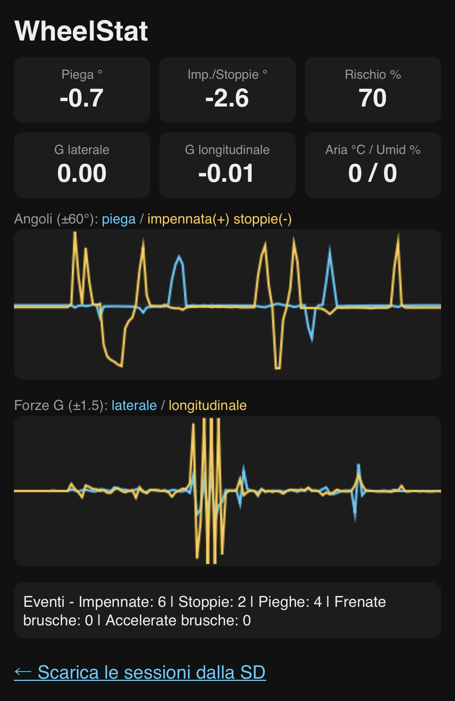

# WheelStat


>  **Seleziona la lingua / Select your language:** [🇮🇹 Italiano](#italiano) · [🇬🇧 English](#english)

---

<a id="italiano"></a>
## 🇮🇹 Italiano

WheelStat è un sistema di telemetria open source basato su ESP32, progettato per moto. Grazie all'integrazione di un sensore IMU (Bosch BNO055), il sistema monitora in tempo reale l'angolo di piega, gli angoli di impennata e stoppie e le forze G dinamiche, calcolando contemporaneamente un indice di rischio di perdita di grip basato sui parametri ambientali rilevati da un sensore DHT22.

I dati vengono visualizzati live su un modulo display OLED 0.96" con 4 pulsanti integrati tramite un'interfaccia a 6 schermate e salvati automaticamente su una scheda MicroSD in formato CSV per l'analisi post-sessione. Il firmware include inoltre un contatore di eventi (impennate, stoppie, pieghe importanti, frenate e accelerate brusche), un filtro anti-buca che protegge le statistiche dai falsi picchi, una calibrazione guidata all'avvio, un riepilogo di fine sessione e un access point WiFi che permette di vedere la telemetria live con grafici e di scaricare i log direttamente dal telefono, senza bisogno di internet.

### 📑 Indice

- [Interfaccia e Comandi](#it-interfaccia)
- [Architettura Hardware](#it-architettura)
- [Bill of Materials](#it-bom)
- [Schemi e Immagini del Progetto](#it-schemi)
- [Calibrazione](#it-calibrazione)
- [Come Funziona il Rischio Grip](#it-come-funziona)
- [Filtro Anti-Buca](#it-filtro)
- [Contatore Eventi](#it-eventi)
- [WiFi e Interfaccia Web](#it-wifi)
- [Librerie Richieste](#it-librerie)
- [Struttura dei Dati di Log (CSV)](#it-csv)
- [Note di Sicurezza](#it-sicurezza)
- [Licenza](#it-licenza)
- [Autore](#it-autore)

<a id="it-interfaccia"></a>
### Interfaccia e Comandi

L'interfaccia è organizzata in 6 schermate, scorribili con i tasti SU/GIÙ:

| Pagina | Contenuto |
|---|---|
| **Page 0 — Piega** | Angolo di inclinazione laterale con barra grafica dinamica e banner di pericolo a soglia variabile in base al rischio grip |
| **Page 1 — Meteo** | Temperatura, umidità dell'aria e percentuale di rischio grip |
| **Page 2 — Forza G** | Radar grafico con tracciamento delle accelerazioni |
| **Page 3 — Impennata / Stoppie** | Angolo di beccheggio con indicatore verticale bidirezionale: la pagina passa automaticamente da IMPENNATA a STOPPIE in base alla manovra in corso |
| **Page 4 — SD Diagnostica** | Stato della MicroSD (con rilevamento della scheda), nome del file corrente e minuti registrati |
| **Page 5 — WiFi** | Accensione/spegnimento dell'access point, SSID, password, indirizzo del sito e numero di client connessi |

<a id="it-architettura"></a>
#### Schema di Cablaggio (Pinout)

Tutti i moduli comunicano con l'ESP32 tramite i bus standard I2C e SPI o pin digitali dedicati:

| Componente | Bus / Segnale | Pin ESP32 | Note |
|---|---|---|---|
| OLED SSD1306 | I2C (SDA) | GPIO 21 | Condiviso con BNO055 |
| OLED SSD1306 | I2C (SCL) | GPIO 22 | Condiviso con BNO055 |
| Bosch BNO055 | I2C (SDA) | GPIO 21 | Indirizzo I2C standard: 0x28 |
| Bosch BNO055 | I2C (SCL) | GPIO 22 | Indirizzo I2C standard: 0x28 |
| DHT22 | GPIO Digitale | GPIO 4 | Pull-up 4.7–10 kΩ sul dato (integrata nei moduli breakout) |
| Lettore MicroSD | SPI (CS) | GPIO 5 | Chip Select |
| Lettore MicroSD | SPI (MOSI) | GPIO 23 | Master Out Slave In |
| Lettore MicroSD | SPI (MISO) | GPIO 19 | Master In Slave Out |
| Lettore MicroSD | SPI (SCK) | GPIO 18 | Serial Clock |
| Pulsante SU | GPIO Digitale | GPIO 13 | Configurato come INPUT_PULLUP |
| Pulsante GIÙ | GPIO Digitale | GPIO 25 | Configurato come INPUT_PULLUP |
| Pulsante OK | GPIO Digitale | GPIO 14 | Configurato come INPUT_PULLUP |
| Pulsante LOG | GPIO Digitale | GPIO 27 | Configurato come INPUT_PULLUP |

<a id="it-bom"></a>
### Bill of Materials

| Componente | Quantità | Note |
|---|---|---|
| ESP32 DevKit V1 | 1 | Microcontrollore principale |
| Bosch BNO055 | 1 | IMU a 9 assi |
| DHT22 | 1 | Sensore temperatura/umidità|
| Display OLED SSD1306 (I2C, 128x64) | 1 | Interfaccia grafica |
| Modulo lettore MicroSD (SPI) | 1 | + scheda MicroSD formattata FAT32 |
| Pulsanti tattili | 4 | SU / GIÙ / OK / LOG (resistenza di pull-up integrata nel modulo) |
| Cavi jumper / dupont | q.b. | Collegamenti |
| Alimentazione | 1 | alimentazione usb-c |

<a id="it-schemi"></a>
### Schemi e Immagini del Progetto

#### Schema Elettrico / Circuitale


#### Schema Topografico


#### Interfaccia OLED


#### Interfaccia Web



<a id="it-calibrazione"></a>
### Calibrazione

Il sistema prevede due calibrazioni distinte:

**Calibrazione guidata all'avvio (magnetometro).** Dopo il boot, il display mostra una schermata dedicata con un "8" e delle frecce che indicano il movimento da compiere in aria con la scatola, insieme al valore live `MAG x/3` letto dal BNO055. Il sistema resta in attesa finché il magnetometro non raggiunge il livello 3; a calibrazione riuscita si rimane sulla schermata di conferma finché non si preme un tasto, così la sessione parte solo quando lo decide il pilota. Con il tasto OK la calibrazione può essere saltata. All'uscita tutte le statistiche vengono azzerate: i movimenti fatti per calibrare non restano nei contatori.

<a id="it-come-funziona"></a>
### Come Funziona il Rischio Grip

L'indice di rischio grip è una stima, non una misura diretta di aderenza. Il firmware incrocia la temperatura e l'umidità rilevate dal DHT22 per valutare condizioni potenzialmente sfavorevoli (es. asfalto freddo o umido) e restituisce una percentuale di rischio indicativa (0–100%), mostrata a display con eventuali allarmi visivi:

- **Umidità** sopra il 55%: ogni punto percentuale oltre soglia aggiunge 1.3 punti di rischio
- **Temperatura** sotto i 20 °C: ogni grado sotto soglia aggiunge 3.5 punti di rischio

Il rischio calcolato rende inoltre **dinamica la soglia di allarme piega** della Page 0: partendo da una piega massima teorica di 55°, ogni punto di rischio riduce di 0.35° l'angolo oltre il quale scatta il banner lampeggiante `! PERICOLO GRIP !`. Più le condizioni sono sfavorevoli, prima arriva l'avviso. Non sostituisce la valutazione diretta del pilota sulle reali condizioni dell'asfalto.

<a id="it-filtro"></a>
### Filtro Anti-Buca

I record e i contatori eventi non lavorano sui valori istantanei ma sul **livello sostenuto**: di ogni grandezza viene tenuto il minimo all'interno di una finestra mobile di 150 ms. L'urto di una buca dura 20–80 ms e non riesce a sollevare quel minimo, mentre una piega o una frenata reale durano secondi e attraversano il filtro indenni. In questo modo un colpo secco sull'asfalto non viene registrato come frenata brusca o impennata record.

I valori mostrati live su display e interfaccia web restano volutamente non filtrati, per mantenere la massima reattività.

<a id="it-eventi"></a>
### Contatore Eventi

Il firmware conta automaticamente le manovre che superano una soglia sul livello sostenuto:

| Evento | Soglia |
|---|---|
| Impennata | ≥ 15° |
| Stoppie | ≥ 10° |
| Piega importante (da entrambi i lati) | ≥ 35° |
| Frenata brusca | ≥ 0.70 G |
| Accelerata brusca | ≥ 0.50 G |

**Riepilogo di fine sessione.** Alla pressione di LOG per fermare la registrazione, l'OLED mostra due schermate consecutive: i massimi di sessione per tutti i canali con la durata totale, poi il contatore eventi. Si avanza con un tasto qualsiasi; dopo 30 secondi di inattività il riepilogo si chiude da solo.

<a id="it-wifi"></a>
### WiFi e Interfaccia Web

Dalla Page 5, con il tasto OK, l'ESP32 accende un **access point WiFi** (SSID `WheelStat`) al quale ci si collega direttamente dal telefono: non serve alcuna rete esterna né connessione a internet. L'indirizzo del sito è `http://192.168.4.1` (mostrato anche a display).

Il sito onboard offre:

- **Elenco sessioni** (`/`): lista dei file `LOG_n.CSV` presenti sulla MicroSD con dimensione e link di download diretto. Il download è bloccato durante la registrazione per non fermare la telemetria.
- **Telemetria live** (`/live`): valori istantanei di piega, impennata/stoppie, forze G, meteo e rischio grip aggiornati ~3 volte al secondo, due grafici scorrevoli con ~36 secondi di storia (angoli ±60°, forze G ±1.5) e i contatori eventi. La pagina è completamente autocontenuta (HTML+CSS+JS senza librerie esterne).

La password dell'access point è definita nel firmware (costante `WIFI_PASSWORD`).

<a id="it-librerie"></a>
### 📦 Librerie Richieste

Per compilare correttamente il firmware su Arduino IDE assicurati di aver installato le seguenti librerie:

- `Adafruit BNO055` (di Adafruit)
- `Adafruit SSD1306` (di Adafruit)
- `Adafruit GFX Library` (di Adafruit)
- `DHT sensor library` (di Adafruit)
- `Adafruit Unified Sensor` (richiesta come dipendenza comune)

`Wire`, `SPI`, `SD`, `WiFi` e `WebServer` sono già incluse nel core ESP32 per Arduino: non richiedono installazione.

<a id="it-csv"></a>
### Struttura dei Dati di Log (CSV)

I file di log vengono salvati in modo sequenziale nella root della SD con la nomenclatura `LOG_1.CSV`, `LOG_2.CSV`, ecc. Ogni minuto viene scritta una riga contenente i **massimi del minuto** per ciascun canale insieme ai dati meteo:

```
Minuto,Piega_Dx,Piega_Sx,Impennata,Stoppie,GLat_Dx,GLat_Sx,G_Accel,G_Frena,Temp_C,Umid_%,Rischio_%
1,32.5,28.0,0.0,0.0,0.85,0.72,0.45,0.60,24.5,48.0,0
2,41.2,38.7,12.4,0.0,1.02,0.95,0.52,0.78,24.4,49.0,0
```

Alla chiusura della registrazione viene accodato un **blocco di riepilogo** nello stesso formato a colonne: i massimi dell'intera sessione con i minuti totali, seguiti dai contatori eventi con le rispettive soglie scritte nell'intestazione, così i numeri restano interpretabili anche riaprendo il file a distanza di tempo:

```
RIEPILOGO,Piega_Dx,Piega_Sx,Impennata,Stoppie,GLat_Dx,GLat_Sx,G_Accel,G_Frena,Minuti_Tot
MAX,41.2,38.7,12.4,0.0,1.02,0.95,0.52,0.78,2
EVENTI,Impennate>15,Stoppie>10,Pieghe>35,Frenate>0.7G,Accelerate>0.5G
TOT,0,0,3,1,2
```

Il file viene aperto e chiuso a ogni scrittura: in caso di distacco dell'alimentazione si perde al massimo l'ultimo minuto, mai l'intero file. La scheda viene rilevata anche se inserita a caldo (ricontrollo ogni 2 secondi sulla Page 4 e re-inizializzazione all'avvio della registrazione).

<a id="it-sicurezza"></a>
### ⚠️ Note di Sicurezza

WheelStat è pensato come strumento di analisi post-sessione e non come ausilio alla guida in tempo reale. Non consultare il display mentre si è in movimento: tenere sempre lo sguardo sulla strada/pista ha priorità assoluta.
Il display deve essere consultato post sessione registrandolo con una telecamera esterna per avere un feedback preciso nell'istante desiderato. Anche la telemetria live via WiFi è destinata a un passeggero, ai box o all'analisi da fermi: mai al pilota in movimento.
Il rischio grip calcolato è indicativo e non sostituisce l'esperienza del pilota né la valutazione diretta delle condizioni dell'asfalto e degli pneumatici. Verifica sempre che il montaggio dell'hardware sul veicolo sia solido e non interferisca con comandi o visuale.

<a id="it-licenza"></a>
### 📄 Licenza

Questo progetto è distribuito sotto licenza **Apache License 2.0**. Consulta il file [LICENSE](LICENSE)

<a id="it-autore"></a>
### Autore

Progettato e sviluppato da **Alessandro Rota** con il supporto indispensabile di (tanta) caffeina.


---

<a id="english"></a>
## 🇬🇧 English

WheelStat is an open source telemetry system based on ESP32, designed for motorcycles. Thanks to the integration of an IMU sensor (Bosch BNO055), the system monitors in real time the lean angle, the wheelie and stoppie angles and the dynamic G-forces, while simultaneously calculating a grip-loss risk index based on the environmental parameters detected by a DHT22 sensor.

Data is displayed live on a 0.96" OLED display module with 4 integrated buttons through a 6-screen interface and is automatically saved to a MicroSD card in CSV format for post-session analysis. The firmware also includes an event counter (wheelies, stoppies, deep lean angles, hard braking and hard acceleration), a pothole-rejection filter that protects the statistics from false spikes, a guided calibration at startup, an end-of-session summary and a WiFi access point that lets you watch live telemetry with charts and download the logs directly from your phone, with no internet connection required.

### 📑 Table of Contents

- [Interface and Controls](#en-interface)
- [Hardware Architecture](#en-architecture)
- [Bill of Materials](#en-bom)
- [Project Diagrams and Images](#en-diagrams)
- [Calibration](#en-calibration)
- [How Grip Risk Works](#en-how-it-works)
- [Pothole-Rejection Filter](#en-filter)
- [Event Counter](#en-events)
- [WiFi and Web Interface](#en-wifi)
- [Required Libraries](#en-libraries)
- [Log Data Structure (CSV)](#en-csv)
- [Safety Notes](#en-safety)
- [License](#en-license)
- [Author](#en-autore)

<a id="en-interface"></a>
### Interface and Controls

The interface is organized into 6 screens, scrollable with the UP/DOWN buttons:

| Page | Content |
|---|---|
| **Page 0 — Lean** | Lateral lean angle with a dynamic graphic bar and a danger banner whose threshold varies with the grip risk |
| **Page 1 — Weather** | Temperature, air humidity and grip risk percentage |
| **Page 2 — G-Force** | Graphic radar with acceleration tracking |
| **Page 3 — Wheelie / Stoppie** | Pitch angle with a bidirectional vertical indicator: the page automatically switches between WHEELIE and STOPPIE depending on the maneuver in progress |
| **Page 4 — SD Diagnostics** | MicroSD status (with card detection), current file name and minutes logged |
| **Page 5 — WiFi** | Access point on/off, SSID, password, site address and number of connected clients |

<a id="en-architecture"></a>
#### Wiring Diagram (Pinout)

All modules communicate with the ESP32 via the standard I2C and SPI buses, or dedicated digital pins:

| Component | Bus / Signal | ESP32 Pin | Notes |
|---|---|---|---|
| OLED SSD1306 | I2C (SDA) | GPIO 21 | Shared with BNO055 |
| OLED SSD1306 | I2C (SCL) | GPIO 22 | Shared with BNO055 |
| Bosch BNO055 | I2C (SDA) | GPIO 21 | Standard I2C address: 0x28 |
| Bosch BNO055 | I2C (SCL) | GPIO 22 | Standard I2C address: 0x28 |
| DHT22 | Digital GPIO | GPIO 4 | 4.7–10 kΩ pull-up on the data line (built into breakout modules) |
| MicroSD Reader | SPI (CS) | GPIO 5 | Chip Select |
| MicroSD Reader | SPI (MOSI) | GPIO 23 | Master Out Slave In |
| MicroSD Reader | SPI (MISO) | GPIO 19 | Master In Slave Out |
| MicroSD Reader | SPI (SCK) | GPIO 18 | Serial Clock |
| UP Button | Digital GPIO | GPIO 13 | Configured as INPUT_PULLUP |
| DOWN Button | Digital GPIO | GPIO 25 | Configured as INPUT_PULLUP |
| OK Button | Digital GPIO | GPIO 14 | Configured as INPUT_PULLUP |
| LOG Button | Digital GPIO | GPIO 27 | Configured as INPUT_PULLUP |

<a id="en-bom"></a>
### Bill of Materials

| Component | Quantity | Notes |
|---|---|---|
| ESP32 DevKit V1 | 1 | Main microcontroller |
| Bosch BNO055 | 1 | 9-axis IMU |
| DHT22 | 1 | Temperature/humidity sensor|
| OLED SSD1306 Display (I2C, 128x64) | 1 | Graphic interface |
| MicroSD reader module (SPI) | 1 | + FAT32-formatted MicroSD card |
| Tactile buttons | 4 | UP / DOWN / OK / LOG (pull-up resistor built into the module) |
| Jumper / dupont wires | as needed | Connections |
| Power supply | 1 | USB-C power supply |

<a id="en-diagrams"></a>
### Project Diagrams and Images

#### Circuit Diagram


#### Topographic Diagram


#### OLED Interface


#### Web Interface


<a id="en-calibration"></a>
### Calibration

The system uses two distinct calibrations:

**Guided calibration at startup (magnetometer).** After boot, the display shows a dedicated screen with a figure-8 and arrows indicating the motion to perform in the air with the enclosure, together with the live `MAG x/3` value read from the BNO055. The system waits until the magnetometer reaches level 3; once calibrated, it stays on the confirmation screen until a button is pressed, so the session starts only when the rider decides. Calibration can be skipped with the OK button. On exit, all statistics are reset: the movements made while calibrating do not remain in the counters.

<a id="en-how-it-works"></a>
### How Grip Risk Works

The grip risk index is an estimate, not a direct measurement of traction. The firmware cross-references the temperature and humidity detected by the DHT22 to assess potentially unfavorable conditions (e.g. cold or damp asphalt) and returns an indicative risk percentage (0–100%), shown on the display along with any visual alerts:

- **Humidity** above 55%: each percentage point over the threshold adds 1.3 risk points
- **Temperature** below 20 °C: each degree under the threshold adds 3.5 risk points

The calculated risk also makes the **Page 0 lean alert threshold dynamic**: starting from a theoretical maximum lean of 55°, each risk point reduces by 0.35° the angle beyond which the flashing `! PERICOLO GRIP !` banner is triggered. The worse the conditions, the earlier the warning. It does not replace the rider's direct assessment of the actual road surface conditions.

<a id="en-filter"></a>
### Pothole-Rejection Filter

Records and event counters do not work on instantaneous values but on the **sustained level**: for each quantity, the minimum within a 150 ms rolling window is kept. A pothole impact lasts 20–80 ms and cannot lift that minimum, while a real lean or braking maneuver lasts seconds and passes through the filter unharmed. This way, a sharp hit on the asphalt is not recorded as hard braking or a record wheelie.

The values shown live on the display and web interface are deliberately unfiltered, to keep maximum responsiveness.

<a id="en-events"></a>
### Event Counter

The firmware automatically counts the maneuvers that exceed a threshold on the sustained level:

| Event | Threshold |
|---|---|
| Wheelie | ≥ 15° |
| Stoppie | ≥ 10° |
| Deep lean (either side) | ≥ 35° |
| Hard braking | ≥ 0.70 G |
| Hard acceleration | ≥ 0.50 G |

**End-of-session summary.** When LOG is pressed to stop the recording, the OLED shows two consecutive screens: the session maxima for all channels with the total duration, then the event counter. Any button advances; after 30 seconds of inactivity the summary closes by itself.

<a id="en-wifi"></a>
### WiFi and Web Interface

From Page 5, with the OK button, the ESP32 turns on a **WiFi access point** (SSID `WheelStat`) that you connect to directly from your phone: no external network or internet connection is needed. The site address is `http://192.168.4.1` (also shown on the display).

The onboard site offers:

- **Session list** (`/`): list of the `LOG_n.CSV` files on the MicroSD with size and direct download link. Downloading is blocked while recording, so as not to stall the telemetry.
- **Live telemetry** (`/live`): instantaneous lean, wheelie/stoppie, G-forces, weather and grip risk values updated ~3 times per second, two scrolling charts with ~36 seconds of history (angles ±60°, G-forces ±1.5) and the event counters. The page is fully self-contained (HTML+CSS+JS with no external libraries).

The access point password is defined in the firmware (`WIFI_PASSWORD` constant).

<a id="en-libraries"></a>
### 📦 Required Libraries

To correctly compile the firmware in Arduino IDE make sure you have installed the following libraries:

- `Adafruit BNO055` (by Adafruit)
- `Adafruit SSD1306` (by Adafruit)
- `Adafruit GFX Library` (by Adafruit)
- `DHT sensor library` (by Adafruit)
- `Adafruit Unified Sensor` (required as a common dependency)

`Wire`, `SPI`, `SD`, `WiFi` and `WebServer` are already included in the ESP32 Arduino core: no installation required.

<a id="en-csv"></a>
### Log Data Structure (CSV)

Log files are saved sequentially in the SD card's root directory with the naming `LOG_1.CSV`, `LOG_2.CSV`, etc. Every minute, one row is written containing the **per-minute maxima** for each channel along with the weather data:

```
Minuto,Piega_Dx,Piega_Sx,Impennata,Stoppie,GLat_Dx,GLat_Sx,G_Accel,G_Frena,Temp_C,Umid_%,Rischio_%
1,32.5,28.0,0.0,0.0,0.85,0.72,0.45,0.60,24.5,48.0,0
2,41.2,38.7,12.4,0.0,1.02,0.95,0.52,0.78,24.4,49.0,0
```

When the recording is stopped, a **summary block** is appended in the same column format: the maxima of the entire session with the total minutes, followed by the event counters with their thresholds written in the header, so the numbers remain interpretable even when reopening the file after some time:

```
RIEPILOGO,Piega_Dx,Piega_Sx,Impennata,Stoppie,GLat_Dx,GLat_Sx,G_Accel,G_Frena,Minuti_Tot
MAX,41.2,38.7,12.4,0.0,1.02,0.95,0.52,0.78,2
EVENTI,Impennate>15,Stoppie>10,Pieghe>35,Frenate>0.7G,Accelerate>0.5G
TOT,0,0,3,1,2
```

The file is opened and closed at every write: in case of power loss, at most the last minute is lost, never the whole file. The card is detected even when hot-inserted (recheck every 2 seconds on Page 4 and re-initialization when recording starts).

<a id="en-safety"></a>
### ⚠️ Safety Notes

WheelStat is designed as a post-session analysis tool, not as a real-time riding aid. Do not look at the display while riding: keeping your eyes on the road/track always has absolute priority.
The display should be reviewed after the session by recording it with an external camera, in order to get precise feedback at the desired moment. The live WiFi telemetry is likewise intended for a passenger, the pits or stationary analysis: never for the rider while moving.
The calculated grip risk is indicative and does not replace the rider's experience or their direct assessment of asphalt and tire conditions. Always make sure the hardware mounting on the vehicle is solid and does not interfere with controls or visibility.

<a id="en-license"></a>
### 📄 License

This project is distributed under the **Apache License 2.0**. See the [LICENSE](LICENSE) file.

<a id="en-autore"></a>
### Author

Designed and developed by **Alessandro Rota** with the indispensable support of (lots of) caffeine.
