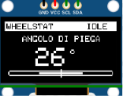
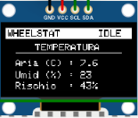
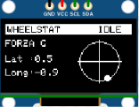
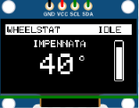
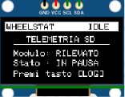
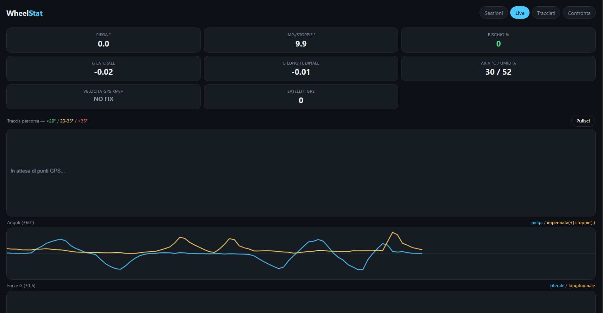

# WheelStat


> **Seleziona la lingua / Select your language:** [🇮🇹 Italiano](#italiano) · [🇬🇧 English](#english)

---

<a id="italiano"></a>
## 🇮🇹 Italiano

Telemetria per moto su **ESP32**. Un'IMU **BNO055** misura angolo di piega, impennata/stoppie e forze G; un **DHT22** legge temperatura e umidità e ne ricava un indice di rischio grip; un **GPS NEO-6M/8M** aggiunge velocità, posizione e cronometraggio dei giri.

Tutto si vede su un **OLED 128×64** a 10 pagine con 4 pulsanti e su un **sito servito dall'ESP32 stesso** (il telefono si collega al suo access point, senza internet). Ogni sessione si registra in **CSV sulla flash interna**.

[Interfaccia OLED](#it-oled) · [Cablaggio](#it-hardware) · [Quale ESP32](#it-schede) · [Compilare](#it-build) · [**Orientamento dell'IMU**](#it-orientamento) · [Cosa misura](#it-misure) · [Giri e tracciati](#it-giri) · [Sito](#it-web) · [File](#it-file) · [Componenti sostituibili](#it-driver) · [Sicurezza](#it-sicurezza)

<a id="it-oled"></a>
### Interfaccia OLED

**SU/GIÙ** scorrono le pagine, **LOG** avvia e ferma la registrazione, **OK** cambia funzione a seconda della pagina.

| # | Pagina | Contenuto | Tasto OK |
|---|---|---|---|
| 0 | **Piega** | Angolo di inclinazione, numero grande e barra dal centro. Banner di allarme oltre la soglia di sicurezza, che si abbassa quando sale il rischio grip | Taratura zero |
| 1 | **Meteo** | Temperatura, umidità, rischio grip | - |
| 2 | **Forza G** | G laterale e longitudinale, con radar 2D | - |
| 3 | **Impennata / Stoppie** | Angolo di beccheggio, colonna verticale | Taratura zero |
| 4 | **GPS** | Stato del fix, velocità, posizione, satelliti | - |
| 5 | **Giri** | Distanza dal prossimo obiettivo, giro in corso, ultimo, record | Imposta il traguardo |
| 6 | **Record 1/2** | Migliori di sempre: piega, impennata/stoppie, G laterali | - |
| 7 | **Record 2/2** | Migliori di sempre: G longitudinali, velocità | - |
| 8 | **Memoria** | Spazio libero, file in scrittura, minuti registrati | - |
| 9 | **WiFi** | SSID, password, indirizzo del sito, client collegati | Accende/spegne l'AP |







Una barra fissa in cima mostra `REC` durante la registrazione e lo stato del GPS se il lap timing è attivo.

**All'avvio** il firmware elenca i cinque componenti mentre li accende, col nome del driver e una spunta o una croce. Sono controlli reali (ACK I2C per OLED e IMU, lettura forzata per il DHT22, ascolto NMEA per il GPS, mount per la flash), quindi un componente scollegato prende una croce. Segue la **calibrazione del magnetometro** (l'otto da percorrere con la scatola in mano), saltabile con OK.

<a id="it-hardware"></a>
### Cablaggio

Pin dell'**ESP32 classico** (DevKit V1). Per S3/S2/C3 vedi [Quale ESP32](#it-schede).

| Componente | Bus / Segnale | Pin | Note |
|---|---|---|---|
| OLED SSD1306 | I2C SDA / SCL | 21 / 22 | Indirizzo `0x3C` |
| Bosch BNO055 | I2C SDA / SCL | 21 / 22 | Indirizzo `0x28` (`0x29` su alcuni breakout) |
| DHT22 | GPIO | 4 | Linea dati singola |
| GPS NEO-6M/8M | UART2 | 16 (RX) / 17 (TX) | 9600 baud. **Il TX del modulo va su GPIO 16** |
| Pulsanti SU / GIÙ / OK / LOG | GPIO | 13 / 25 / 14 / 27 | `INPUT_PULLUP`, verso GND |

**Bill of materials:** ESP32 DevKit V1 · Bosch BNO055 breakout · DHT22 · OLED SSD1306 I2C 128×64 · GPS u-blox NEO-6M o NEO-8M con antenna · 4 pulsanti tattili (spesso già sul modulo display) · cavi dupont · alimentazione USB.

Pin e indirizzi stanno tutti in [Config.h](Config.h).

<a id="it-schede"></a>
### Quale ESP32

Il firmware gira su tutta la famiglia. La piedinatura si adegua da sola alla board selezionata nell'IDE: non c'è nessuna macro da impostare.

| Chip | Stato | SU/GIÙ/OK/LOG | DHT | SDA/SCL | GPS RX/TX | UART | Flash |
|---|---|---|---|---|---|---|---|
| **ESP32** (DevKit V1) | montato | 13 / 25 / 14 / 27 | 4 | 21 / 22 | 16 / 17 | 2 | 82 % |
| **ESP32-S3** | 🔧 | 5 / 6 / 7 / 15 | 4 | 8 / 9 | 18 / 17 | 2 | 81 % |
| **ESP32-S2** | 🔧 | 5 / 6 / 7 / 15 | 4 | 8 / 9 | 18 / 17 | 1 | 78 % |
| **ESP32-C3** | 🔧 | 3 / 4 / 5 / 6 | 10 | 8 / 9 | 0 / 1 | 1 | **90 %** |

🔧 = compila e rispetta i vincoli del chip, ma **non è mai stata cablata**: confrontala con la serigrafia della tua board prima di saldare. Solo il classico è provato su hardware.

Tre cose da sapere:

- **C3 e S2 hanno due sole UART** e la 0 è quella del monitor seriale, quindi al GPS resta la 1 (già impostato).
- **Sul C3 il firmware occupa il 90% della flash**
- Un chip della famiglia non previsto (C6, H2) dà un errore di compilazione: aggiungi il suo blocco in [Config.h](Config.h) copiando il più simile. Fuori dalla famiglia Espressif servirebbe un porting (`WiFi.h`, `WebServer.h` e LittleFS nativi esistono solo lì).

<a id="it-build"></a>
### Compilare

Sketch Arduino IDE. **I file `.ino` devono stare nella stessa cartella, chiamata esattamente `WheelStat`.** Monitor seriale a **115200**.

Librerie da installare: `Adafruit BNO055` · `Adafruit SSD1306` · `Adafruit GFX Library` · `DHT sensor library` · `Adafruit Unified Sensor` · `TinyGPSPlus`. `Wire`, `WiFi`, `WebServer` e `LittleFS` arrivano col core ESP32.

```bash
arduino-cli compile --fqbn esp32:esp32:esp32doit-devkit-v1 .
```

<a id="it-orientamento"></a>
### Orientamento dell'IMU: da fare per prima su una scatola nuova

**Sbagliarlo non dà nessun errore: dà telemetria plausibile e sbagliata.** Va provato con la scatola in mano. Due passaggi, entrambi in [Config.h](Config.h).

**Passo 1, la posizione.** Come è girata la basetta dell'IMU; il riferimento è la faccia dei componenti. Scommenta **una** riga:

```cpp
#define IMU_MONTAGGIO_SOTTOSOPRA  // montato: basetta capovolta
// #define IMU_MONTAGGIO_DRITTA   // componenti in su, basetta in piano
// #define IMU_MONTAGGIO_MANUALE  // nessuna delle due: scegli tu P0...P7
```

Il BNO055 ha otto orientamenti predefiniti (P0…P7) e li applica nel chip. Per una posizione insolita si accende `IMU_MONTAGGIO_MANUALE` e si prova un'altra P.

**Passo 2, i versi.** Accendi, muovi la scatola, controlla. Ogni riga sbagliata si corregge invertendo un segno:

| Muovi la scatola così | Deve succedere | Se è al contrario inverti |
|---|---|---|
| Inclinala a **destra** | sale `Piega Dx` (pagina 0) | `SEGNO_PIEGA` |
| Alza il **davanti** | sale `Impennata`, non `Stoppie` (pagina 3) | `SEGNO_IMPENNATA` |
| Spingila in **avanti** | `Long` positivo, pallino in **alto** (pagina 2) | `SEGNO_G_LONG` |
| Spingila a **sinistra** | pallino a **sinistra** (pagina 2) | `SEGNO_G_LAT` |

> Se trovi due grandezze **scambiate** (la piega si muove quando alzi il muso) non è un segno: è il passo 1 da rifare. I `SEGNO_*` invertono un verso, non scambiano due assi.

**Taratura zero** (tasto OK sulle pagine 0 e 3, da fermi e in piano): compensa il montaggio non in bolla. Vive in RAM, si rifà a ogni accensione.

<a id="it-misure"></a>
### Cosa misura

Ogni grandezza è un **canale sempre positivo**: quelle con segno si sdoppiano, così destra e sinistra hanno il loro massimo separato.

`Piega_Dx` · `Piega_Sx` · `Impennata` · `Stoppie` · `GLat_Dx` · `GLat_Sx` · `G_Accel` · `G_Frena` · `Vel_Kmh`

**Filtro anti-buca.** Massimi, record e contatori guardano il minimo su una finestra di 150 ms: solo un livello *mantenuto* conta. L'urto di una buca dura 20-80 ms e non diventa un record di piega. I valori live su OLED e sito restano non filtrati.

**Eventi.** Contati quando il livello sostenuto supera la soglia; per essere ricontati devono prima scendere al 70% di essa.

| Evento | Soglia |
|---|---|
| Impennata | 15° |
| Stoppie | 10° |
| Piega (da entrambi i lati) | 35° |
| Frenata brusca | 0.70 G |
| Accelerata brusca | 0.50 G |

**Rischio grip.** Indice 0-100% da umidità e temperatura: sale sopra il 55% di umidità e sotto i 20 °C. È una stima delle condizioni, non una misura di aderenza; serve soprattutto ad abbassare la soglia dell'allarme piega.

<a id="it-giri"></a>
### Giri e tracciati

Con un fix valido, **OK sulla pagina GIRI** salva la posizione attuale come traguardo. In modalità libera resta in RAM; salvando un **tracciato** dal sito, traguardo, forma e record restano sulla flash.

Ogni tracciato può avere fino a **2 checkpoint intermedi**, che dividono il giro in settori cronometrati separatamente. La **forma** del circuito si registra da sola sul giro più veloce di sessione.

Il GPS gira a **5 Hz**: il firmware spegne via UBX le frasi NMEA inutilizzate, perché a 9600 baud quelle di default saturerebbero la seriale.

<a id="it-web"></a>
### Sito

Dalla pagina **WiFi** (tasto OK) l'ESP32 alza un access point. Collega il telefono alla rete `WheelStat` (password a display) e apri **`http://192.168.4.1`**.

| Pagina | Cosa fa |
|---|---|
| **Sessioni** (`/`) | Elenco dei log: scarica in CSV o GPX, elimina |
| **Live** (`/live`) | Telemetria in tempo reale con grafici |
| **Tracciati** (`/tracciati`) | Classifica giri, tracciato attivo, record, settori, forma |
| **Confronta** (`/confronta`) | Due sessioni a confronto, giro per giro |


Il download è bloccato durante la registrazione.

<a id="it-file"></a>
### File

| File | Contenuto |
|---|---|
| `LOG_n.CSV` | Una sessione |
| `RECORD.BIN` | Record storici della modalità libera |
| `TRACK_n.BIN` | Tracciato: nome, traguardo, forma, checkpoint |
| `TRACK_n_REC.BIN` | Record storici su quel tracciato |

Una riga al minuto coi massimi di quel minuto, poi in coda riepilogo, eventi con le soglie e tempi sul giro (una colonna per settore se il tracciato ha checkpoint):

```
Minuto,Piega_Dx,Piega_Sx,Impennata,Stoppie,GLat_Dx,GLat_Sx,G_Accel,G_Frena,Vel_Kmh,Temp_C,Umid_%,Rischio_%,Lat,Lon,Giro
1,42.3,38.1,12.4,0.0,0.81,0.74,0.42,0.63,87,18.4,62,14,45.46411,9.18854,0
...

TRACCIATO,libera
RIEPILOGO,Piega_Dx,...,Vel_Kmh,Minuti_Tot
MAX,48.7,...,112,23
EVENTI,Impennate>15,Stoppie>10,Pieghe>35,Frenate>0.7G,Accelerate>0.5G
TOT,3,0,17,9,12

GIRI,Tempo_s
1,94.2
```

<a id="it-driver"></a>
### Componenti sostituibili

Meteo, display, GPS e IMU si cambiano con **una riga in [Config.h](Config.h)**.

| Categoria | Alternative |
|---|---|
| Meteo | DHT22 · SHT4x · SHT31 · HTU31D · Si7021 · HTU21D · AHT20 · BME280 |
| Display | SSD1306 · SSD1309 · SH1106 · SH1107 (tutti 128×64) |
| GPS | u-blox M6/M8/M9 · u-blox M10 · NMEA generico |
| IMU | BNO055 |

⚠️ **Solo il primo di ogni categoria è provato su hardware.** Gli altri rispettano il contratto e compilano.

[docs/DRIVER.md](docs/DRIVER.md) per aggiungere un driver, [docs/HARDWARE.md](docs/HARDWARE.md) per compatibilità e indirizzi I2C, [docs/CHANGELOG.md](docs/CHANGELOG.md) per lo storico versioni.

<a id="it-sicurezza"></a>
### ⚠️ Sicurezza

Strumento di **analisi post-sessione**, non un ausilio alla guida. Non guardare il display mentre si è in movimento. Per rivedere i dati in un istante preciso, riprendi il display con una telecamera esterna.

Il rischio grip è indicativo e non sostituisce la valutazione diretta di asfalto e pneumatici. Verifica che il montaggio sul veicolo sia solido e non interferisca con comandi o visuale.

### Licenza e autore

**Apache License 2.0**. Progettato e sviluppato da **Alessandro Rota**.

---

<a id="english"></a>
## 🇬🇧 English

Motorcycle telemetry on **ESP32**. A **BNO055** IMU measures lean angle, wheelie/stoppie and G-forces; a **DHT22** reads temperature and humidity and derives a grip-risk index; a **NEO-6M/8M GPS** adds speed, position and lap timing.

Everything shows on a **128×64 OLED** with 10 pages and 4 buttons, and on a **website served by the ESP32 itself** (your phone connects to its access point, no internet). Each session is logged as **CSV on the internal flash**.

[OLED interface](#en-oled) · [Wiring](#en-hardware) · [Which ESP32](#en-boards) · [Build](#en-build) · [**IMU orientation**](#en-orientation) · [What it measures](#en-measures) · [Laps and tracks](#en-laps) · [Web](#en-web) · [Files](#en-files) · [Swappable components](#en-drivers) · [Safety](#en-safety)

<a id="en-oled"></a>
### OLED interface

**UP/DOWN** scroll the pages, **LOG** starts and stops recording, **OK** does a different job per page.

| # | Page | Content | OK button |
|---|---|---|---|
| 0 | **Lean** | Lean angle, large number and a bar from the centre. Alert banner past the safety threshold, which lowers as grip risk rises | Zero calibration |
| 1 | **Weather** | Temperature, humidity, grip risk | - |
| 2 | **G-Force** | Lateral and longitudinal G, with a 2D radar | - |
| 3 | **Wheelie / Stoppie** | Pitch angle, vertical column | Zero calibration |
| 4 | **GPS** | Fix status, speed, position, satellites | - |
| 5 | **Laps** | Distance to next target, current lap, last, best | Sets the finish line |
| 6 | **Records 1/2** | All-time best: lean, wheelie/stoppie, lateral G | - |
| 7 | **Records 2/2** | All-time best: longitudinal G, speed | - |
| 8 | **Memory** | Free space, file being written, minutes logged | - |
| 9 | **WiFi** | SSID, password, site address, connected clients | Toggles the AP |

A fixed top bar shows `REC` while recording and GPS status when lap timing is active.

**At boot** the firmware lists the five components as it powers them up, with the driver name and a tick or a cross. These are real checks (I2C ACK for OLED and IMU, a forced reading for the DHT22, NMEA listening for the GPS, mount for the flash), so an unplugged component gets a cross. Then comes **magnetometer calibration** (the figure-eight to trace with the box in hand), skippable with OK.

<a id="en-hardware"></a>
### Wiring

Pins for the **classic ESP32** (DevKit V1). For S3/S2/C3 see [Which ESP32](#en-boards).

| Component | Bus / Signal | Pin | Notes |
|---|---|---|---|
| OLED SSD1306 | I2C SDA / SCL | 21 / 22 | Address `0x3C` |
| Bosch BNO055 | I2C SDA / SCL | 21 / 22 | Address `0x28` (`0x29` on some breakouts) |
| DHT22 | GPIO | 4 | Single data line |
| GPS NEO-6M/8M | UART2 | 16 (RX) / 17 (TX) | 9600 baud. **The module's TX goes to GPIO 16** |
| Buttons UP / DOWN / OK / LOG | GPIO | 13 / 25 / 14 / 27 | `INPUT_PULLUP`, to GND |

**Bill of materials:** ESP32 DevKit V1 · Bosch BNO055 breakout · DHT22 · OLED SSD1306 I2C 128×64 · u-blox NEO-6M or NEO-8M GPS with antenna · 4 tactile buttons (often already on the display module) · dupont wires · USB power.

Pins and addresses all live in [Config.h](Config.h).

<a id="en-boards"></a>
### Which ESP32

The firmware runs on the whole family. The pinout follows the board selected in the IDE: no macro to set.

| Chip | Status | UP/DOWN/OK/LOG | DHT | SDA/SCL | GPS RX/TX | UART | Flash |
|---|---|---|---|---|---|---|---|
| **ESP32** (DevKit V1) | built | 13 / 25 / 14 / 27 | 4 | 21 / 22 | 16 / 17 | 2 | 82 % |
| **ESP32-S3** | 🔧 | 5 / 6 / 7 / 15 | 4 | 8 / 9 | 18 / 17 | 2 | 81 % |
| **ESP32-S2** | 🔧 | 5 / 6 / 7 / 15 | 4 | 8 / 9 | 18 / 17 | 1 | 78 % |
| **ESP32-C3** | 🔧 | 3 / 4 / 5 / 6 | 10 | 8 / 9 | 0 / 1 | 1 | **90 %** |

🔧 = compiles and respects the chip's constraints, but **has never been wired**: check it against your board's silkscreen before soldering. Only the classic one is hardware-tested.

Three things to know:

- **C3 and S2 have only two UARTs** and UART 0 is the serial monitor, so the GPS gets UART 1 (already set).
- **On the C3 the firmware fills 90% of the flash**: the RISC-V core.
- A family chip that isn't listed (C6, H2) fails to compile: add its block in [Config.h](Config.h) by copying the closest one. Outside the Espressif family it would be a port (native `WiFi.h`, `WebServer.h` and LittleFS only exist there).

<a id="en-build"></a>
### Build

An Arduino IDE sketch. **All `.ino` files must sit in the same folder, named exactly `WheelStat`.** Serial monitor at **115200**.

Libraries to install: `Adafruit BNO055` · `Adafruit SSD1306` · `Adafruit GFX Library` · `DHT sensor library` · `Adafruit Unified Sensor` · `TinyGPSPlus`. `Wire`, `WiFi`, `WebServer` and `LittleFS` ship with the ESP32 core.

```bash
arduino-cli compile --fqbn esp32:esp32:esp32doit-devkit-v1 .
```

<a id="en-orientation"></a>
### IMU orientation: do this first on a new build

**Getting it wrong raises no error: it produces plausible, wrong telemetry.** Try it with the box in your hand. Two steps, both in [Config.h](Config.h).

**Step 1, the position.** How the IMU board is turned; the reference is the component side. Uncomment **one** line:

```cpp
#define IMU_MONTAGGIO_SOTTOSOPRA  // built like this: board upside down
// #define IMU_MONTAGGIO_DRITTA   // components up, board flat
// #define IMU_MONTAGGIO_MANUALE  // neither: pick P0...P7 yourself
```

The BNO055 has eight predefined orientations (P0…P7) and applies them inside the chip. For an unusual position, enable `IMU_MONTAGGIO_MANUALE` and try another P.

**Step 2, the directions.** Power up, move the box, check. Any wrong row is fixed by flipping one sign:

| Move the box like this | What should happen | If reversed, flip |
|---|---|---|
| Lean it **right** | `Piega Dx` rises (page 0) | `SEGNO_PIEGA` |
| Lift the **front** | `Impennata` rises, not `Stoppie` (page 3) | `SEGNO_IMPENNATA` |
| Push it **forward** | `Long` positive, dot **up** (page 2) | `SEGNO_G_LONG` |
| Push it **left** | dot to the **left** (page 2) | `SEGNO_G_LAT` |

> If you find two quantities **swapped** (lean moves when you lift the nose) that's not a sign: it's step 1 to redo. The `SEGNO_*` flags invert a direction, they don't swap axes.

**Zero calibration** (OK on pages 0 and 3, stopped and level): compensates for a box that isn't level. Lives in RAM, redone at every power-up.

<a id="en-measures"></a>
### What it measures

Every quantity is an **always-positive channel**: signed ones split in two, so left and right each keep their own maximum.

`Piega_Dx` (lean right) · `Piega_Sx` (lean left) · `Impennata` (wheelie) · `Stoppie` · `GLat_Dx` · `GLat_Sx` · `G_Accel` · `G_Frena` (braking) · `Vel_Kmh`

**Pothole filter.** Maximums, records and counters look at the minimum over a 150 ms window: only a level *held* for the whole window counts. A pothole impact lasts 20-80 ms and never becomes a lean record. Live values on the OLED and the site stay unfiltered.

**Events.** Counted when the sustained level crosses the threshold; to be counted again they must first drop to 70% of it.

| Event | Threshold |
|---|---|
| Wheelie | 15° |
| Stoppie | 10° |
| Lean (either side) | 35° |
| Hard braking | 0.70 G |
| Hard acceleration | 0.50 G |

**Grip risk.** A 0-100% index from humidity and temperature: it rises above 55% humidity and below 20 °C. An estimate of conditions, not a traction measurement; its main job is lowering the lean-alert threshold.

<a id="en-laps"></a>
### Laps and tracks

With a valid fix, **OK on the LAPS page** saves the current position as the finish line. In free mode it lives in RAM; saving a **track** from the website keeps line, shape and records on the flash.

Each track can hold up to **2 intermediate checkpoints**, splitting the lap into separately timed sectors. The circuit **shape** records itself on the fastest lap of the session.

The GPS runs at **5 Hz**: the firmware turns off unused NMEA sentences via UBX, because at 9600 baud the default set would saturate the line.

<a id="en-web"></a>
### Web

From the **WiFi** page (OK button) the ESP32 brings up an access point. Connect your phone to `WheelStat` (password on the display) and open **`http://192.168.4.1`**.

| Page | What it does |
|---|---|
| **Sessions** (`/`) | Log list: download as CSV or GPX, delete |
| **Live** (`/live`) | Real-time telemetry with charts |
| **Tracks** (`/tracciati`) | Lap leaderboard, active track, records, sectors, shape |
| **Compare** (`/confronta`) | Two sessions side by side, lap by lap |

Downloads are blocked while recording.

<a id="en-files"></a>
### Files

| File | Content |
|---|---|
| `LOG_n.CSV` | One session |
| `RECORD.BIN` | All-time records for free mode |
| `TRACK_n.BIN` | Track: name, finish line, shape, checkpoints |
| `TRACK_n_REC.BIN` | All-time records on that track |

One row per minute with that minute's maximums, then the summary, events with their thresholds, and lap times (one column per sector if the track has checkpoints):

```
Minuto,Piega_Dx,Piega_Sx,Impennata,Stoppie,GLat_Dx,GLat_Sx,G_Accel,G_Frena,Vel_Kmh,Temp_C,Umid_%,Rischio_%,Lat,Lon,Giro
1,42.3,38.1,12.4,0.0,0.81,0.74,0.42,0.63,87,18.4,62,14,45.46411,9.18854,0
...

TRACCIATO,libera
RIEPILOGO,Piega_Dx,...,Vel_Kmh,Minuti_Tot
MAX,48.7,...,112,23
EVENTI,Impennate>15,Stoppie>10,Pieghe>35,Frenate>0.7G,Accelerate>0.5G
TOT,3,0,17,9,12

GIRI,Tempo_s
1,94.2
```

<a id="en-drivers"></a>
### Swappable components

Weather sensor, display, GPS and IMU are changed with **one line in [Config.h](Config.h)**.

| Category | Alternatives |
|---|---|
| Weather | DHT22 · SHT4x · SHT31 · HTU31D · Si7021 · HTU21D · AHT20 · BME280 |
| Display | SSD1306 · SSD1309 · SH1106 · SH1107 (all 128×64) |
| GPS | u-blox M6/M8/M9 · u-blox M10 · generic NMEA |
| IMU | BNO055 |

⚠️ **Only the first of each category is hardware-tested.** The others honour the contract and compile.

[docs/DRIVER.md](docs/DRIVER.md) for adding a driver, [docs/HARDWARE.md](docs/HARDWARE.md) for compatibility and I2C addresses, [docs/CHANGELOG.md](docs/CHANGELOG.md) for the version history.

<a id="en-safety"></a>
### ⚠️ Safety

A **post-session analysis tool**, not a riding aid. Do not look at the display while moving. To review data at a precise moment, film the display with an external camera.

The grip risk is indicative and does not replace your own assessment of tarmac and tyres. Make sure the mounting is solid and does not interfere with controls or visibility.

### License and author

**Apache License 2.0**. Designed and developed by **Alessandro Rota**.
